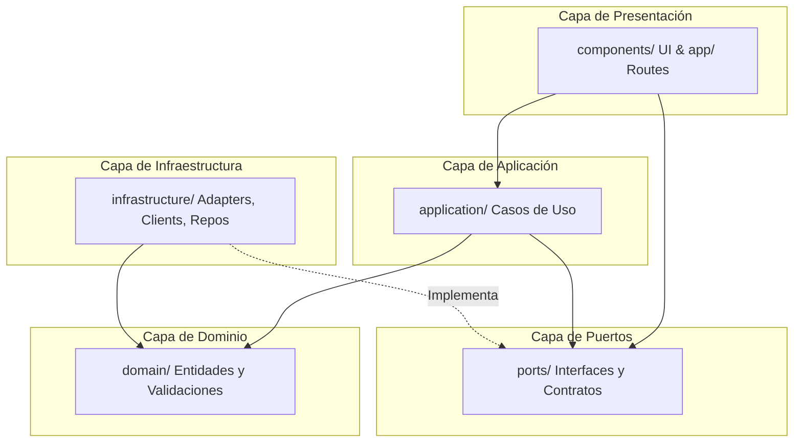

# AGENTS.md — Lo Resuelvo Webapp

Última actualización: 2026-06-16

Fuente canónica para agentes. Leer este archivo primero y cargar skills locales solo cuando apliquen.

## Modo skills-first

1. Leer reglas globales de este archivo.
2. Elegir la skill adecuada del índice.
3. Cargar solo `skills/<skill>/SKILL.md` y referencias puntuales necesarias.
4. Evitar abrir documentación o código no relacionado con la tarea.

## Arquitectura y Stack Tecnológico

### 1. Tecnologías y Stack
- **Framework**: Next.js App Router + React + TypeScript strict.
- **Estilos/UI**: Tailwind CSS, shadcn/Radix primitives, `class-variance-authority`, `clsx`, `tailwind-merge`, `lucide-react`.
- **Testing**: Vitest/Testing Library para unit/component; Cucumber + Playwright para features E2E en `features/`.
- **Deploy**: Next `output: "standalone"`; Dockerfiles y compose para dev/prod.

### 2. Capas (Clean Architecture)
El proyecto sigue una estructura limpia de capas desacopladas, protegiendo las reglas de negocio de la infraestructura y de la UI:



- **Capa de Dominio (`domain/`)**: Contiene lógica pura de negocio, tipos de entidades principales y reglas de validación. Es una capa puramente lógica y agnóstica de frameworks o llamadas HTTP.
- **Capa de Puertos (`ports/`)**: Define las interfaces de entrada y salida (contratos de repositorios y servicios externos).
- **Capa de Aplicación (`application/`)**: Contiene los casos de uso específicos que orquestan las llamadas a puertos y modifican/validan datos del dominio.
- **Capa de Infraestructura (`infrastructure/`)**: Contiene la implementación concreta de los puertos (clientes API, sockets, adaptadores Auth0 y de desarrollo, repositorios concretos y transformaciones de datos DTO a dominio).
- **Capa de Presentación (`components/` & `app/`)**: Componentes de React, Server Actions simples y páginas/rutas que consumen los casos de uso e interactúan con la interfaz.

### Regla de Dependencia Estricta
**Las capas internas nunca dependen de capas externas.** Las capas de `domain/` y `ports/` no deben importar nada bajo ningún concepto de `application/`, `infrastructure/` ni de `components/`. Cualquier comunicación de datos crudos (DTOs) provenientes de la API debe ser transformada al formato del dominio usando mappers en `infrastructure/` antes de propagarse.

---

## Estructura de carpetas

```txt
app/                         Rutas Next.js (App Router), layouts y handlers
application/                 Casos de uso de la aplicación (lógica de negocio orquestada)
components/                  Componentes UI React agrupados por dominio
components/ui/               Primitivas visuales reutilizables (shadcn/radix)
domain/                      Tipos de dominio, entidades y validaciones puras
features/                    Features Gherkin de Cucumber y definiciones de pasos E2E
infrastructure/              Adaptadores de API, autenticación, almacenamiento y websockets
lib/                         Utilidades transversales puras (rutas, utils globales, etc.)
ports/                       Definiciones de puertos / interfaces TypeScript
public/                      Archivos estáticos y públicos
reports/                     Reportes de ejecución E2E generados por Cucumber
skills/                      Skills locales para agentes de IA cargadas bajo demanda
```

---

## Índice de skills locales

- `skills/frontend-us-delivery`
  - Implementar User Stories/features completas con TDD por fases y validación final.
- `skills/frontend-bdd-tdd-process`
  - Guiar BDD con Gherkin/Cucumber y TDD con Vitest/Testing Library siguiendo buenas prácticas.
- `skills/frontend-design`
  - Diseñar/rediseñar pantallas con UI/UX profesional, jerarquía, estados y coherencia visual.
- `skills/frontend-mobile-responsive`
  - Corregir layouts mobile/tablet/desktop sin romper desktop.
- `skills/frontend-accessibility-gates`
  - Validar foco, teclado, semántica, formularios, modales y estados interactivos.
- `skills/frontend-motion-effects`
  - Agregar animaciones/microinteracciones con propósito, reduced motion y performance.
- `skills/frontend-api-client-governance`
  - Gobernar integraciones bajo Clean Architecture: contratos en `ports/`, lógica en `application/`, mappers y adaptadores en `infrastructure/`.
- `skills/frontend-query-governance`
  - Gobernar React Query: keys, cache, invalidaciones, guards y requests redundantes.
- `skills/frontend-testing-gates`
  - Ejecutar validaciones de cierre: Vitest, lint, build y E2E cuando corresponda.
- `skills/frontend-doc-governance`
  - Mantener `AGENTS.md`, `CLAUDE.md`, skills y documentación operativa compacta.
- `skills/frontend-commit-governance`
  - Preparar commits seguros, coherentes y validados.

---

## Mapa rápido de decisión

- “Implementá una feature/US completa”: `frontend-us-delivery`.
- “Definí criterios, Gherkin, RED/GREEN/REFACTOR o tests primero”: `frontend-bdd-tdd-process`.
- “Mejorá el diseño/la landing/una pantalla”: `frontend-design`.
- “Se rompe en mobile/tablet”: `frontend-mobile-responsive`.
- “Formulario/modal/menu/accesibilidad”: `frontend-accessibility-gates`.
- “Agregá animaciones/transiciones”: `frontend-motion-effects`.
- “Cambió API/auth/server action/websocket”: `frontend-api-client-governance`.
- “Cache/refetch/mutación/React Query”: `frontend-query-governance`.
- “Validá todo antes de entregar”: `frontend-testing-gates`.
- “Documentación o instrucciones de agentes”: `frontend-doc-governance`.
- “Commit/PR/handoff”: `frontend-commit-governance`.

---

## Reglas críticas

### Calidad

- Alta cohesión, bajo acoplamiento y estricto desacoplamiento de capas (Clean Architecture).
- Preferir componentes pequeños y reutilizables.
- Mantener tipos explícitos en fronteras de API, auth y datos compartidos utilizando `ports/`.
- No convertir Server Components en Client Components sin necesidad real.

### UI/UX

- UI visible en español.
- Cada pantalla debe contemplar estados `loading`, `empty`, `error`, `disabled` y `success` cuando apliquen.
- CTA principal claro y accesible.
- Mobile-first real; desktop no debe degradarse por fixes mobile.

### Seguridad

- Nunca hardcodear secretos, tokens, passwords ni URLs privadas.
- No commitear `.env` ni archivos con credenciales.
- Evitar logs de payloads sensibles.
- No usar `dangerouslySetInnerHTML` salvo sanitización explícita.
- Mantener errores de usuario genéricos; no filtrar detalles internos.

### Idioma y estilo

- Texto visible para usuarios: español.
- Respuestas al equipo: español, salvo que se pida otro idioma.
- Commits: inglés claro.
- Pruebas unitarias: títulos/descripciones en inglés (`it("should do something", ...)`).
- En código nuevo, respetar el idioma predominante del archivo y nombres existentes.

---

## Comandos de validación

Comandos actuales del repo:

```bash
npm run test
npm run lint
npm run build
npm run test:e2e
```

Equivalentes Make:

```bash
make test
make lint
make build
make test-e2e
```

Política:

1. Durante iteración, ejecutar pruebas focalizadas cuando sea posible.
2. Antes de handoff/PR/cierre robusto: `npm run test && npm run lint && npm run build`.
3. Ejecutar `npm run test:e2e` si cambia un flujo cubierto en `features/` o si el usuario pide paridad E2E.
4. Fail-fast: detenerse en la primera falla, corregir y re-ejecutar.

---

## Checklist final para agentes

1. Skill correcta cargada y aplicada.
2. Diff revisado; sin archivos generados accidentales.
3. Sin secretos ni logs sensibles.
4. Pruebas/validaciones relevantes ejecutadas o razón explícita si no se ejecutaron.
5. Resumen final conciso con archivos tocados, validación y riesgos residuales.
