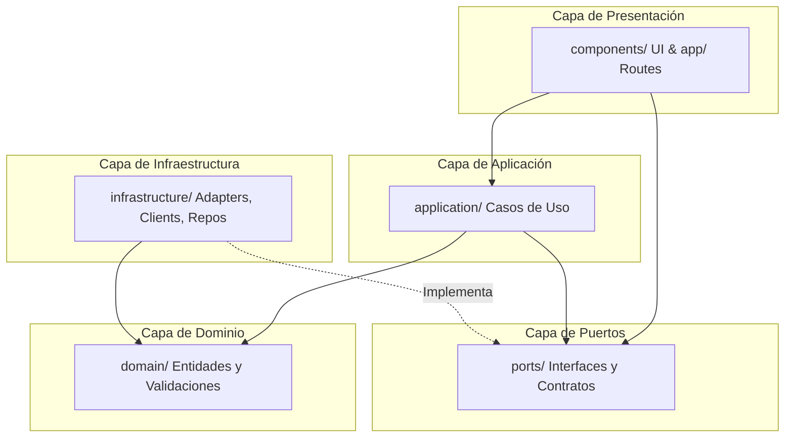

# AGENTS.md — Lo Resuelvo Webapp

Última actualización: 2026-06-17

Fuente canónica para agentes. Leer este archivo primero y cargar skills locales solo cuando apliquen.

## Modo skills-first

1. Leer reglas globales de este archivo.
2. Elegir la skill adecuada del índice.
3. Cargar solo `skills/<skill>/SKILL.md` y referencias puntuales necesarias.
4. Evitar abrir documentación o código no relacionado con la tarea.

## Arquitectura y Stack Tecnológico

### 1. Tecnologías y Stack
- **Framework**: Next.js App Router + React + TypeScript strict.
- **Estilos/UI**: Tailwind CSS, shadcn/Radix primitives, `class-variance-authority`, `clsx`, `tailwind-merge`, `lucide-react`.
- **UI Primitivas**: `Button` (CVA con variantes `brand`, `brandSecondary`, `accept`, `danger`), `Card`, `Avatar` (CVA), `Modal` (Radix Dialog), `Badge`, `Input`, `Label`, `Textarea`.
- **Testing**: Vitest/Testing Library para unit/component; Cucumber + Playwright para features E2E en `features/`.
- **Deploy**: Next `output: "standalone"`; Dockerfiles y compose para dev/prod.

### 2. Capas (Clean Architecture)
El proyecto sigue una estructura limpia de capas desacopladas, protegiendo las reglas de negocio de la infraestructura y de la UI:


```mermaid
graph TD
  subgraph Capa de Presentación
    UI[components/ UI & app/ Routes]
  end

  subgraph Capa de Aplicación
    UC[application/ Casos de Uso]
  end

  subgraph Capa de Puertos
    P[ports/ Interfaces y Contratos]
  end

  subgraph Capa de Dominio
    D[domain/ Entidades y Validaciones]
  end

  subgraph Capa de Infraestructura
    I[infrastructure/ Adapters, Clients, Repos]
  end

  UI --> UC
  UI --> P
  UC --> P
  UC --> D
  I -.->|Implementa| P
  I --> D
```

- **Capa de Dominio (`domain/`)**: Contiene lógica pura de negocio, tipos de entidades principales y reglas de validación. Es una capa puramente lógica y agnóstica de frameworks o llamadas HTTP. **Todos los tipos deben ser camelCase** — nunca snake_case del backend.
- **Capa de Puertos (`ports/`)**: Define las interfaces de entrada y salida (contratos de repositorios y servicios externos). Los tipos de datos en ports deben usar tipos del dominio (camelCase), no DTOs de la API.
- **Capa de Aplicación (`application/`)**: Contiene los casos de uso específicos que orquestan las llamadas a puertos y modifican/validan datos del dominio. Los use cases **no deben tragar errores silenciosamente** — propagan excepciones para que la UI decida cómo manejarlos.
- **Capa de Infraestructura (`infrastructure/`)**: Contiene la implementación concreta de los puertos (clientes API, sockets, adaptadores Auth0 y de desarrollo, repositorios concretos y transformaciones de datos DTO a dominio). Los DTOs del backend (`snake_case`) se definen en `infrastructure/api/types.ts` y se transforman a tipos de dominio (`camelCase`) usando mappers en `infrastructure/repositories/`.
- **Capa de Presentación (`components/` & `app/`)**: Componentes de React, Server Actions simples y páginas/rutas que consumen los casos de uso e interactúan con la interfaz.

### Regla de Dependencia Estricta
**Las capas internas nunca dependen de capas externas.** Las capas de `domain/` y `ports/` no deben importar nada bajo ningún concepto de `application/`, `infrastructure/` ni de `components/`. Cualquier comunicación de datos crudos (DTOs) provenientes de la API debe ser transformada al formato del dominio usando mappers en `infrastructure/` antes de propagarse.

### Regla de Pureza del Dominio
**Los tipos en `domain/` nunca contienen snake_case ni DTOs de API.** Si el backend devuelve `category_name`, el dominio define `categoryName`. La conversión ocurre exclusivamente en mappers dentro de `infrastructure/repositories/` (ej: `provider-mapper.ts`, `conversation-mapper.ts`).

---

## Estructura de carpetas

```txt
app/                         Rutas Next.js (App Router), layouts y handlers
application/                 Casos de uso de la aplicación (lógica de negocio orquestada)
components/                  Componentes UI React agrupados por dominio
components/ui/               Primitivas visuales reutilizables (Button, Card, Avatar, Modal, Badge, Input, etc.)
components/shared/           Componentes reutilizables entre dominios (Header, DetailPanel, HomePage, etc.)
components/messaging/        Componentes del módulo de mensajería (ChatPanel, MessagesList, ContactList, etc.)
domain/                      Tipos de dominio puros (camelCase), entidades y validaciones
features/                    Features Gherkin de Cucumber y definiciones de pasos E2E
infrastructure/              Adaptadores de API, autenticación, almacenamiento y websockets
infrastructure/api/types.ts  DTOs del backend (snake_case) — nunca consumir directamente desde UI
infrastructure/repositories/ Implementaciones de ports + mappers (ApiXxx → dominio)
lib/                         Utilidades transversales puras (routes, utils, text-utils)
ports/                       Definiciones de puertos / interfaces TypeScript
public/                      Archivos estáticos y públicos
reports/                     Reportes de ejecución E2E generados por Cucumber
skills/                      Skills locales para agentes de IA cargadas bajo demanda
```

---

## Índice de skills locales

- `skills/frontend-us-delivery`
  - Implementar User Stories/features completas con TDD por fases y validación final.
- `skills/frontend-bdd-tdd-process`
  - Guiar BDD con Gherkin/Cucumber y TDD con Vitest/Testing Library siguiendo buenas prácticas.
- `skills/frontend-design`
  - Diseñar/rediseñar pantallas con UI/UX profesional, jerarquía, estados y coherencia visual.
- `skills/frontend-mobile-responsive`
  - Corregir layouts mobile/tablet/desktop sin romper desktop.
- `skills/frontend-accessibility-gates`
  - Validar foco, teclado, semántica, formularios, modales y estados interactivos.
- `skills/frontend-motion-effects`
  - Agregar animaciones/microinteracciones con propósito, reduced motion y performance.
- `skills/frontend-api-client-governance`
  - Gobernar integraciones bajo Clean Architecture: contratos en `ports/`, lógica en `application/`, mappers y adaptadores en `infrastructure/`.
- `skills/frontend-query-governance`
  - Gobernar React Query: keys, cache, invalidaciones, guards y requests redundantes.
- `skills/frontend-testing-gates`
  - Ejecutar validaciones de cierre: Vitest, lint, build y E2E cuando corresponda.
- `skills/frontend-doc-governance`
  - Mantener `AGENTS.md`, `CLAUDE.md`, skills y documentación operativa compacta.
- `skills/frontend-commit-governance`
  - Preparar commits seguros, coherentes y validados.

---

## Mapa rápido de decisión

- “Implementá una feature/US completa”: `frontend-us-delivery`.
- “Definí criterios, Gherkin, RED/GREEN/REFACTOR o tests primero”: `frontend-bdd-tdd-process`.
- “Mejorá el diseño/la landing/una pantalla”: `frontend-design`.
- “Se rompe en mobile/tablet”: `frontend-mobile-responsive`.
- “Formulario/modal/menu/accesibilidad”: `frontend-accessibility-gates`.
- “Agregá animaciones/transiciones”: `frontend-motion-effects`.
- “Cambió API/auth/server action/websocket”: `frontend-api-client-governance`.
- “Cache/refetch/mutación/React Query”: `frontend-query-governance`.
- “Validá todo antes de entregar”: `frontend-testing-gates`.
- “Documentación o instrucciones de agentes”: `frontend-doc-governance`.
- “Commit/PR/handoff”: `frontend-commit-governance`.

---

## Reglas críticas

### Calidad

- Alta cohesión, bajo acoplamiento y estricto desacoplamiento de capas (Clean Architecture).
- Preferir componentes pequeños y reutilizables. **Un componente principal por archivo.**
- Mantener tipos explícitos en fronteras de API, auth y datos compartidos utilizando `ports/`.
- No convertir Server Components en Client Components sin necesidad real.
- **Los use cases en `application/` no deben tragar errores** con `console.error + return []`. Propagar la excepción para que la UI decida (error state vs empty state).
- Usar `catch (error: unknown)` en vez de `catch (error: any)` — TypeScript strict.

### Design System

- Usar las primitivas de `components/ui/` con sus variantes CVA antes de escribir CSS inline.
- `Button`: usar variantes `brand`, `brandSecondary`, `accept`, `danger`, `ghost`, `link`. Sizes: `full`, `action`, `icon`.
- `Avatar`: usa CVA con sizes `xs`, `sm`, `md`, `lg`, `xl`.
- `Modal`: basado en Radix Dialog. Provee focus trap, cierre con Escape, bloqueo de scroll y portal automáticamente. **No crear modales caseros con `div fixed`.**
- `Card`: variantes `default`, `interactive`, `custom`.
- `DetailPanel`: componente reutilizable para vistas de detalle con avatar + nombre + título + descripción.
- `InfoBanner`: para banners informativos/warning. No crear SVGs inline para banners.

### i18n

- **Todo texto visible al usuario debe estar en `infrastructure/i18n/translations.ts`.**
- No hardcodear strings en español en componentes — usar `t.seccion.clave`.
- Agregar import `import { t } from "@/infrastructure/i18n/translations"` cuando sea necesario.
- Mantener las claves organizadas por sección: `home`, `messaging`, `header`, `consumerSearch`, `providerHome`, `onboarding`.

### UI/UX

- UI visible en español (`lang="es-AR"` en el HTML root).
- Cada pantalla debe contemplar estados `loading`, `empty`, `error`, `disabled` y `success` cuando apliquen.
- CTA principal claro y accesible.
- Mobile-first real; desktop no debe degradarse por fixes mobile.

### Seguridad

- Nunca hardcodear secretos, tokens, passwords ni URLs privadas.
- No commitear `.env` ni archivos con credenciales.
- Evitar logs de payloads sensibles.
- No usar `dangerouslySetInnerHTML` salvo sanitización explícita.
- Mantener errores de usuario genéricos; no filtrar detalles internos.

### Idioma y estilo

- Texto visible para usuarios: español, centralizado en `translations.ts`.
- Respuestas al equipo: español, salvo que se pida otro idioma.
- Commits: inglés claro siguiendo la convención del proyecto: `<type>[optional scope]: <description>` (ej: `feat[26]: implement ...`, `fix[26]: ...`, `test[US-26]: ...`, `docs: ...`).
- Pruebas unitarias: títulos/descripciones en inglés (`it("should do something", ...)`).
- En código nuevo, respetar el idioma predominante del archivo y nombres existentes.
- Tipos de dominio en camelCase; DTOs de la API en snake_case solo dentro de `infrastructure/`.

### Flujo de Desarrollo Incremental, Commits y Feedback Visual

- **Avance Escenario por Escenario y Micro-Paso (Step) por Micro-Paso:**
  - Prohibido desarrollar múltiples escenarios de golpe o agrupar múltiples capas en un solo commit. Avanzar estrictamente escenario por escenario bajo el flujo **Outside-In (Double-Loop TDD)** en pasos atómicos (1 commit por micro-paso):
    1. **Outside (UI TSX inicial):** Componente de presentación mínimo con props iniciales/mocks + feedback visual.
    2. **Middle (Aplicación & Dominio):** Caso de uso, tipos y contratos guiados por unit tests RED -> GREEN.
    3. **Inside (Infraestructura):** DTOs, mappers, repositorios y Server Actions.
    4. **Integración & Cierre:** Conexión del TSX con Server Action, verificación E2E en GREEN y retiro de `@wip`.
- **Reporte y Commits por cada Step completado:**
  - Por cada micro-paso completado, el agente **DEBE**:
    1. Indicar brevemente los cambios realizados y archivos modificados.
    2. Sugerir el comando de commit listo para ejecutar con formato canónico:
       ```bash
       git add <archivos>
       git commit -m "<type>[<issue>]: <descripción>"
       ```
       *Nota:* Mantener la descripción concisa; no incluir aclaraciones redundantes como "and i18n keys" o "with tests" ya que son implícitas.
    3. Si el paso incluye código TSX que renderiza un componente o vista, proveer **feedback visual inmediato (Screenshot)** con Playwright.
- **Detalle de procesos:** Cargar `skills/frontend-us-delivery` para implementación de User Stories y `skills/frontend-bdd-tdd-process` para BDD/TDD y la Matriz de los 5 Estados de UI.

### Testing y E2E (Reglas Críticas de Aislamiento y Paralelismo)

- **`CustomWorld` obligatorio en Step Definitions**:
  - Todo step de Cucumber **DEBE** tiparse con `async function (this: CustomWorld, ...)` y acceder al browser mediante `this.page`.
  - **PROHIBIDO** declarar variables globales o de módulo como `let page: Page` o singletons compartidos. Rompe la ejecución en paralelo.
- **Hooks centralizados**:
  - Toda la inicialización y limpieza del ciclo de vida de Playwright (`browser`, `context`, `page`) se gestiona **exclusivamente en `features/support/hooks.ts`**. Nunca definir `BeforeAll`, `Before` o `After` en archivos de steps.
- **Detección dinámica de entorno y Mocks**:
  - Los tests E2E inyectan la sesión y los stubs dinámicamente por petición mediante cookies (`__e2e_session` y `__e2e_api_stubs_*`).
  - No usar flags en tiempo de compilación (`NEXT_PUBLIC_*`) para alternar lógica de mock.
  - La seguridad en la nube se gestiona con `APP_ENV=production` (configurado en `compose.prod.yml`), lo cual desactiva cualquier bypass de mocks para usuarios reales.
- **Portabilidad en CI y Prohibición de Rutas Locales:**
  - **PROHIBIDO** commitear rutas absolutas locales del filesystem (ej. `/home/...` o rutas a carpetas de artefactos de agentes) dentro de step definitions o archivos de prueba. Rompe los pipelines de CI con `ENOENT`.
- **Navegación y Rutas en E2E:**
  - Usar siempre las constantes de `ROUTES` de `@/lib/routes` (ej: `ROUTES.provider.jobs`, `ROUTES.consumer.services`) en los steps de navegación en lugar de URLs hardcodeadas.
  - Para cambios de pestañas o filtros interactivos, verificar hidratación con polling/reintentos sobre `aria-selected` antes de buscar elementos hijos.
- **Manejo de Imágenes en E2E:**
  - Componentes de preview/galería con imágenes mockeadas o dinámicas deben usar `unoptimized` en `<Image />` o declarar sus dominios en `next.config.ts` para no provocar caídas de Error Boundary en Next.js.
- **Gestión del tag `@wip`:**
  - Retirar la etiqueta `@wip` de un escenario únicamente cuando dicho escenario ya esté completamente implementado y verificado en verde localmente.

---

## Comandos de validación

Comandos actuales del repo:

```bash
npm run test
npm run lint
npm run build
npm run test:e2e
```

Equivalentes Make y flujos aislados:

```bash
# Desarrollo
make dev                 # Dev server en puerto 3000
make docker-dev          # Dev server en Docker (puerto 3000)

# Calidad y Unitarios
make test                # Vitest unit/component
make lint                # ESLint

# Tests E2E en Node local (por defecto corren contra http://localhost:3001)
make build && make start-test
make test-e2e            # Toda la suite contra http://localhost:3001
make test-e2e-file FILE=features/login.feature

# Tests E2E en Docker (paridad 100% con imagen de producción)
make docker-test-e2e     # Levanta contenedor en 3001, corre tests y apaga
```

Política:

1. Durante iteración, ejecutar pruebas focalizadas cuando sea posible.
2. Antes de handoff/PR/cierre robusto: `npm run test && npm run lint && npm run build`.
3. Ejecutar `make test-e2e` (o `make docker-test-e2e`) si cambia un flujo cubierto en `features/` o si se pide paridad E2E.
4. Fail-fast: detenerse en la primera falla, corregir y re-ejecutar.

---

## Checklist final para agentes

1. Skill correcta cargada y aplicada.
2. Steps E2E usan `this.page` con `CustomWorld` (sin `let page` global).
3. Diff revisado; sin archivos generados accidentales.
4. Sin secretos ni logs sensibles.
5. Pruebas/validaciones relevantes ejecutadas o razón explícita si no se ejecutaron.
6. Resumen final conciso con archivos tocados, validación y riesgos residuales.
