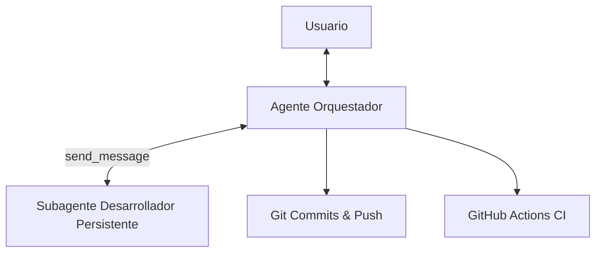

# Frontend AI Development Workflow

Esta skill define el protocolo canónico de trabajo para agentes de IA en `loresuelvo-webapp`, optimizando la velocidad de entrega, el consumo de tokens y la seguridad absoluta contra regresiones en el pipeline de CI/CD.

---

## 1. Arquitectura de Equipo de IA

Para evitar el sobrecosto de contexto y reinicios continuos de memoria, el desarrollo se organiza en dos roles claros:

### A. Agente Orquestador (Parent Agent)
- **Responsabilidad**: Plan maestro de la User Story, interacción con el usuario, control de Quality Gates, ejecución de commits atómicos, push a `main` y monitoreo del pipeline remoto con `gh run list`.
- **Regla**: No realiza micro-ediciones dispersas si implican desarrollo de capas completas; delega tareas atómicas y bien delimitadas al subagente desarrollador.

### B. Subagente Desarrollador Persistente (Single Persistent Worker)
- **Responsabilidad**: Implementación de código en las capas correspondientes (UI TSX, Dominio, Infraestructura, Casos de Uso, Steps BDD).
- **Ciclo de vida**: Se invoca **una única vez al inicio de la US** con `invoke_subagent`. Permanece activo durante toda la sesión y recibe micro-instrucciones mediante `send_message`.
- **Regla de respuesta**: Al completar cada micro-paso, responde con **2 o 3 líneas concisas** (archivos modificados y resumen técnico), quedando listo para la siguiente instrucción.
- **PROHIBIDO**: Crear y destruir subagentes descartables para cada micro-paso de cada escenario.

---

## 2. Matriz de Decisión de Tests y Quality Gates

Para maximizar la velocidad sin comprometer jamás la estabilidad del pipeline, la ejecución de tests se rige por la siguiente matriz estricta:

| Caso | Tipo de Cambio | Validación Requerida | Tiempo Estimado |
|---|---|---|---|
| **Caso A** | **Código Nuevo Aislado** *(TSX nuevo, función de dominio, DTO, mapper o use-case no conectado aún a un escenario activo)* | `npm run test -- <archivo>` + `npx tsc --noEmit` | ~2 segundos |
| **Caso B** | **Integración del Escenario Actual** *(Conexión con Server Action y step definitions del escenario actual de la feature)* | `make test-e2e-file FILE=features/...feature` | ~15-20 segundos |
| **Caso C** | **Modificación de Componente Existente o Compartido** *(Cambios en `PaymentResultPage`, `Header`, `api-client`, Server Actions compartidas o layouts usados por escenarios previos)* | **Suite E2E Completa** `make test-e2e` antes del commit | ~2 minutos |
| **Caso D** | **Cierre de Regla o Entrega Final de la US** *(Validación final integral de toda la plataforma)* | `npm run lint` + `npx tsc` + `npm run test` + `npm run build` + `make test-e2e` | ~2.5 minutos |

---

## 3. Disciplina Outside-In y Commits Atómicos

Cada escenario de la User Story se implementa en 4 micro-pasos atómicos (1 commit por micro-paso):

1. **Outside (Presentación TSX & i18n)**:
   - Componente visual delgado (`< 80 líneas`) con props iniciales y mock callbacks.
   - Textos visibles en `infrastructure/i18n/translations.ts`.
   - Unit tests en `*.test.tsx` con React Testing Library cubriendo la matriz de estados.
   - *Commit*: `feat[XX]: add <component> presentation component`

2. **Middle (Dominio Puro & Puertos)**:
   - Tipos de dominio en `domain/` estrictamente en **camelCase**.
   - Funciones puras y reglas invariantes con sus unit tests en `*.test.ts`.
   - *Commit*: `feat[XX]: define domain models and predicates for <feature>`

3. **Inside (Infraestructura & Aplicación)**:
   - DTOs en `infrastructure/api/types.ts` en **snake_case**.
   - Mappers puros (`snake_case` $\rightarrow$ `camelCase`) con unit tests.
   - Repositorio concreto en `infrastructure/repositories/`.
   - Caso de uso en `application/` (sin tragar excepciones) y Server Action en `app/*/actions.ts`.
   - *Commit*: `feat[XX]: implement <feature> repository, use case and server action`

4. **Integración & Cierre BDD**:
   - Conexión del TSX con la Server Action.
   - Definición de steps en `features/*/*_steps.ts`.
   - Retiro de `@wip` del escenario actual y verificación en verde.
   - *Commit*: `feat[XX]: pass scenario <NN> for <description>`

---

## 4. Buenas Prácticas en Step Definitions (BDD / Cucumber)

- **Regla de 3 a 5 líneas**: Todo step definition debe ser pegamento declarativo y conciso.
- **Extracción Obligatoria de Helpers**: Si varios steps comparten configuración (sesión, stubs de órdenes/propuestas, activePayment en sessionStorage), **se debe extraer una función helper privada al inicio del archivo** (ej: `setupWorkOrderAwaitingPayment(this)`, `seedActivePayment(this, intentId)`).
- **Factories Centralizadas**: Usar siempre `features/support/factories.ts`. Prohibido pegar JSONs crudos dentro de los steps.
- **Aislamiento en Paralelo**: Guardar todo estado temporal del escenario en `this` (`CustomWorld`). Prohibido declarar `let` a nivel de módulo.

---

## 5. Higiene de Contexto y Economía de Tokens

- **Inspección Quirúrgica de Código**:
  - Localizar primero el número de línea con `grep_search`.
  - Usar `view_file` con `StartLine` y `EndLine` (ventanas de 30 a 60 líneas).
  - Prohibido leer archivos completos (>100 líneas) para ver una función específica.
- **Logging Estructurado**:
  - Usar siempre `@/infrastructure/logging/logger` (`logger.debug/info/warn/error`).
  - Prohibido `console.log` crudo. Las trazas de stubs o llamadas internas deben clasificarse como `logger.debug` para no ensuciar la salida de terminal en tests.
- **Formato Limpio de Terminal**:
  - Cucumber configurado con reporter `summary` (salida de 4 líneas sin barras de progreso ANSI).
  - Fail-fast en stubs E2E para evitar timeouts de 5 segundos.
